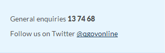
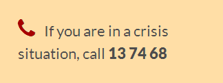
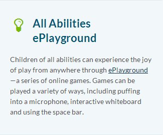

# Asides

- [Contacts](#contacts)
- [Emergency contact](#emergency-contact)
- [Tip](#tip)

## Contacts

XHTML 1.0 

```html
<div class="aside contact">
    <ul>
        <li class="telephone">General enquiries <span class="tel">13 74 68</span></li>
        <li class="twitter">Follow us on Twitter <a href="http://twitter.com/qgovonline">@qgovonline</a></li>
    </ul>
</div>
```

Screenshot



## Emergency contact

XHTML 1.0

```html
<div class="aside emergency-contact">
    <p>If you are in a crisis situation, call <span class="tel">13 74 68</span></p>
</div>
```

Screenshot



## Tip

XHTML 1.0

```html
<div class="aside tip">
<h2>All Abilities ePlayground</h2>
<p>Children of all abilities can experience the joy of play from anywhere through
<a href="http://www.allabilitiesplayground.net.au/">ePlayground</a>&mdash;a series of online games.
Games can be played a variety of ways, including puffing into a microphone, interactive whiteboard and using the space bar.
</p></div>
```

Screenshot

