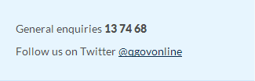
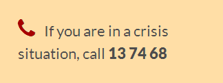
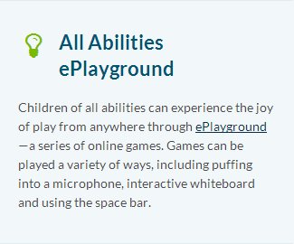
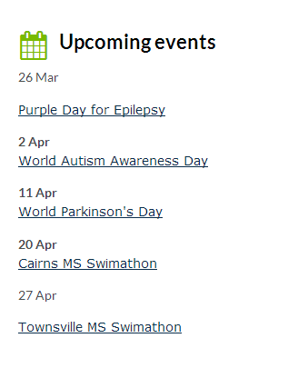
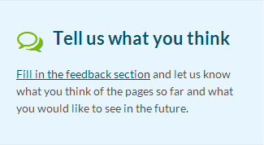
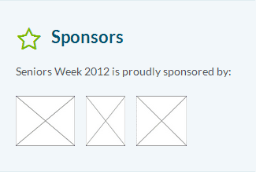
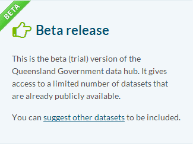

# Asides

- [Contacts (asides)](#contacts)
- [Emergency contact](#emergency-contact)
- [Tip](#tip)
- [Events (franchise landing page)](#events)
- [Feedback](#feedback)
- [Sponsors](#sponsors)
- [Beta indicator](#beta-indicator) 

## Contacts

### XHTML 1.0 

```html
<div class="aside contact">
    <ul>
        <li class="telephone">General enquiries <span class="tel">13 74 68</span></li>
        <li class="twitter">Follow us on Twitter <a href="http://twitter.com/qgovonline">@qgovonline</a></li>
    </ul>
</div>
```

### Screenshot



## Emergency contact

### XHTML 1.0

```html
<div class="aside emergency-contact">
    <p>If you are in a crisis situation, call <span class="tel">13 74 68</span></p>
</div>
```

### Screenshot



## Tip

### XHTML 1.0

```html
<div class="aside tip">
<h2>All Abilities ePlayground</h2>
<p>Children of all abilities can experience the joy of play from anywhere through
<a href="http://www.allabilitiesplayground.net.au/">ePlayground</a>&mdash;a series of online games.
Games can be played a variety of ways, including puffing into a microphone, interactive whiteboard and using the space bar.
</p></div>
```

### Screenshot



## Events

Use this for events on a franchise landing page.

### XHTML 1.0

```html
<div class="aside events">
  <div class="section-header">
    <h2>Upcoming events</h2>
  </div>
  <!--#include virtual="/assets/includes/dynamic/events/upcoming.php?dataset=education-events" -->
</div>
```

### Screenshot

[Events from CSV datasets](https://govdex.gov.au/confluence/display/SSQSWE/Events+from+CSV+datasets) support is available

### XHTML 1.0

```html
<div class="aside events">
    <div class="section-header">
        <h2>Upcoming events</h2>
    </div>
 
    <div class="section mar">
        <h3>March</h3>
        <ol>
            <li>
                <p>26 Mar</p>
                <h4>
                    <a href="http://www.epilepsyaustralia.net/Purple_Day/Purple_Day.aspx">Purple Day for Epilepsy</a>
                </h4>
            </li>
        </ol>
    </div>
 
    <div class="section apr">
        <h3>April</h3>
        <ol>
            <li>
                <p class="date">2 Apr</p>
                <h4>
                    <a href="http://www.lightitupblue.com.au/">World Autism Awareness Day</a>
                </h4>
            </li>
            <li class="even">
                <p class="date">11 Apr</p>
                <h4>
                    <a href="http://parkinsons-qld.org.au/events/world-parkinsons-day.html">World Parkinson's Day</a>
                </h4>
            </li>
            <li>
                <p class="date">20 Apr</p>
                <h4>
                    <a href="http://www.msswimathon.com.au/swim-locations/cairns">Cairns MS Swimathon</a>
                </h4>
            </li>
            <li class="even">
                <p>27 Apr</p>
                <h4>
                    <a href="http://www.msswimathon.com.au/swim-locations/townsville">Townsville MS Swimathon</a>
                </h4>
            </li>
        </ol>
    </div>
</div>
```

### Screenshot



## Feedback

### XHTML 1.0

```html
<div class="aside feedback">
    <h2>Tell us what you think</h2>
    
    <p>This site has been designed and developed for you and we would <a href="#page-feedback">love to hear what you think</a> of it.</p>
</div>
```

### Screenshot



## Sponsors

Sponsor logos can be featured in an aside, using a list of linked images.
Each image should be the sponsor's logo and linked to their website. No logo is to be displayed larger than the Coat of Arms (50px high).

### XHTML 1.0 example

```html
<div class="aside sponsors">
    <h2>Sponsors</h2>
 
    <p>Seniors Week 2012 is proudly sponsored by:</p>
    <ul>
        <li><a href="http://www.beyondblue.org.au/"></a></li>
        <li><a href="http://www.4bc.com.au/"></a></li>
        <li><a href="http://www.4bh.com.au/"></a></li>
    </li>
</div>
```

### Screenshot



## Beta indicator

A website/service that is released in a beta state may indicate this with an aside.

### Example (from data.qld.gov.au, November 2012)

```html
<div class="aside beta">
    <h2>Beta release</h2>
    <p>This is the beta (trial) version of the Queensland Government data hub. It gives access to a limited number of datasets that are already publicly available.</p>
    <p>You can <a href="#page-feedback">suggest other datasets</a> to be included.</p>
</div>
```

### Screenshot


