# Content patterns

- [Figures (images, diagrams, captions)](#figures-images-diagrams-captions)
- [Data tables (sortable tables)](#data-tables-sortable-tables)
- [Definition list grid layout](#definition-list-grid-layout)
- [Downloadable document link](#downloadable-document-link)
- [Meta links](#meta-links)
- [Pull-quote](#pull-quote)
- [Pull-quote with citation](#pull-quote-with-citation)
- [Video](#video)
- [Contacts](#contacts)
- [Checklist](#checklist)
- [Side-by-side comparison](#side-by-side-comparison)
- [Side-by-side comparison (advantages and disadvantages)](#side-by-side-comparison-advantages-and-disadvantages)
- [Cross-selling links](#cross-selling-links)
- [News slideshow](#news-slideshow)

Within content, patterns may be used to add semantics that can be enhanced in the presentation and behaviour layers.
- Figures (aka cut-ins)
- Breakout boxes
- Stand first

## Figures (images, diagrams, captions)
### XHTML 1.0
```html
<div class="cut-in">
  
  <div class="figure-credits">…</div>
  <div class="caption">…</div>
</div>
```
### Screenshot
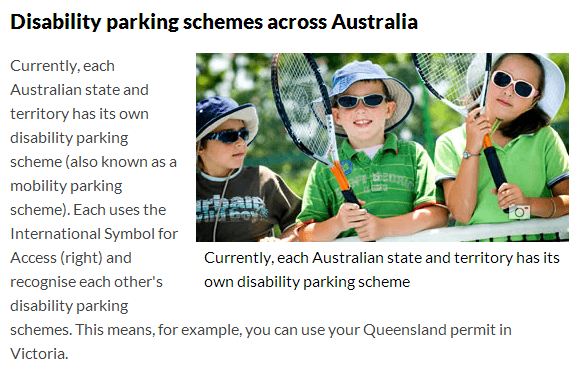

Notes:
- replace class `.cut-in` with `.cut-in-alt` for alternating display. As at 13 October 2011, `.cut-in` are floated right and `.cut-in-alt` are floated left.
- use `.figure` for a figure that is not a cut in (not floated)
-use `.diagram` for diagrams to remove the styling (borders, drop shadow) reserved for photos and feature images. Combine with `.figure` for standard images and `.cut-in` for floated images.

## Data tables (sortable tables)
Use this pattern to include a data table within a content page. The template (and associated scripts) will read the information from this markup pattern and create the data table.
### Example 1
#### XHTML 1.0
```html
<table id="example1" class="data-table">
    <thead>
        <tr>
            <th>Column 1</th>
            <th>Column 2</th>
            <th>etc</th>
        </tr>
    </thead>
    <tbody>
        <tr>
            <td>Row 1 Data 1</td>
            <td>Row 1 Data 2</td>
            <td>etc</td>
        </tr>
        <tr>
            <td>Row 2 Data 1</td>
            <td>Row 2 Data 2</td>
            <td>etc</td>
        </tr>
    </tbody>
</table>
```
#### Screenshot
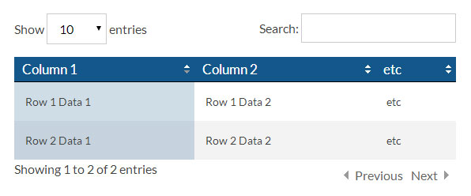

### Example 2
#### XHTML 1.0
```html
<table id="example2" class="data-table">
    <thead>
        <tr>
            <th><a href="birthSelect.m?sort=RegistrationNumberPart2$RegistrationNumberPart4$RegistrationNumberPart3$#matches">Reg #</a></th>
            <th><a href="birthSelect.m?sort=ChildGivenNames#matches">First Name</a></th>
            <th><a href="birthSelect.m?sort=ChildSurname$FatherSurname$MotherSurname$#matches">Last Name</a></th>
            <th><a href="birthSelect.m?sort=FatherGivenNames#matches">Father's Name</a></th>
            <th><a href="birthSelect.m?sort=MotherGivenNames#matches">Mother's Name</a></th>
        </tr>
    </thead>
    <tbody>
        <tr>
            <td><a href="?id=1910/C2020">1910/C2020</a></td>
            <td>Dorothy Grace</td>
            <td>Boyle</td>
            <td>Henry Courtney</td>
            <td>Teresa Maria Young</td>
        </tr>
        <tr>
            <td><a href="?id=1911/C11130">1911/C11130</a></td>
            <td>James Emmet</td>
            <td>Boyle</td>
            <td>Francis</td>
            <td>Mary Ellen Murtagh</td>
        </tr>
        <tr>
            <td><a href="?id=1913/C38">1913/C38</a></td>
            <td>Mona Marguerite</td>
            <td>Boyle</td>
            <td></td>
            <td>Emmeline Boyle</td>
        </tr>
…
    </tbody>
</table>
```
#### Screenshot
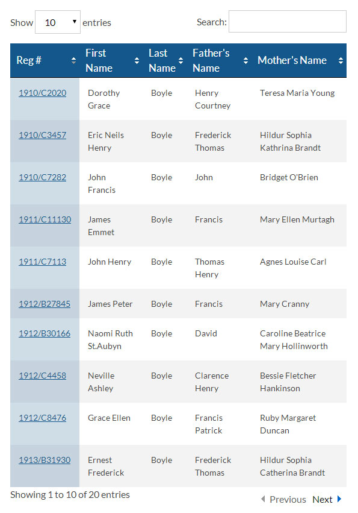

### Example 3
#### XHTML 1.0
```html
<table id="example3" class="data-table">
    <caption>Data table 3</caption>
    <thead>
        <tr>
            <th scope="col">Column header 1</th>
            <th scope="col">Column header 2</th>
            <th scope="col">Column header 3</th>
            <th scope="col">Column header 4</th>
            <th scope="col">Column header 5</th>
            <th scope="col">Column header 6</th>
            <th scope="col">Column header 7</th>
            <th scope="col">Column header 8</th>
            <th scope="col">Column header 9</th>
            <th scope="col">Column header 10</th>
        </tr>
    </thead>
    <tbody>
        <tr>
            <td>Table data</td>
            <td>Table data</td>
            <td>Table data</td>
            <td>Table data</td>
            <td>Table data</td>
            <td>Table data</td>
            <td>Table data</td>
            <td>Table data</td>
            <td>Table data</td>
            <td>Table data</td>
        </tr>
        <tr>
            <td>Table data</td>
            <td>Table data</td>
            <td>Table data</td>
            <td>Table data</td>
            <td>Table data</td>
            <td>Table data</td>
            <td>Table data</td>
            <td>Table data</td>
            <td>Table data</td>
            <td>Table data</td>
        </tr>
…
    </tbody>
</table>
```
#### Screenshot
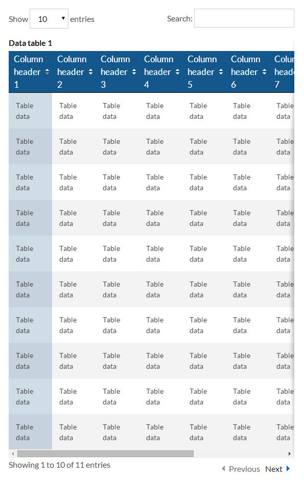

Technical requirements:
- The table must be laid out in a well-formed manner.
- The `thead` and `tbody` sections must be declared.
- The `tfoot` section is optional and will not be used to sort data.
- The table must be assigned a class name value of `data-table`.

Best practice and usage:
- Data tables are best used for tables where sorting is required or for tables with a row count exceeding twelve or more.
- Pagination is also applied if the table row-count is less than the entry count minimum of ten (10) rows. So it is best to use DataTables to large data sets.
- By default, entry count options are displayed as a dropdown menu. Search and pagination are displayed. These cannot be switched off unless specifically requested.
- Odd and even row colours are applied, and the current column used for sorting has a colour applied to aide usability. These cannot be adjusted unless specifically requested.

Notes:
- You can find useful information about how set up data tables from the usage section: https://datatables.net/usage

## Definition list grid layout

Definition lists exist in HTML to pair definitions with values and can be useful for presenting contact details, confirming form inputs and other simple data structures.

### XHTML 1.0

Use the class `grid` with your definition list for a responsive layout: table-like on wider displays, linear on narrow devices.

```html
<dl class="grid">
    <dt id="phone">Phone:</dt>
    <dd>13 23 80</dd>

    <dt id="fax">Fax:</dt>
    <dd>(07) 4091 2668</dd>
    …
</dl>
```

### Screenshot
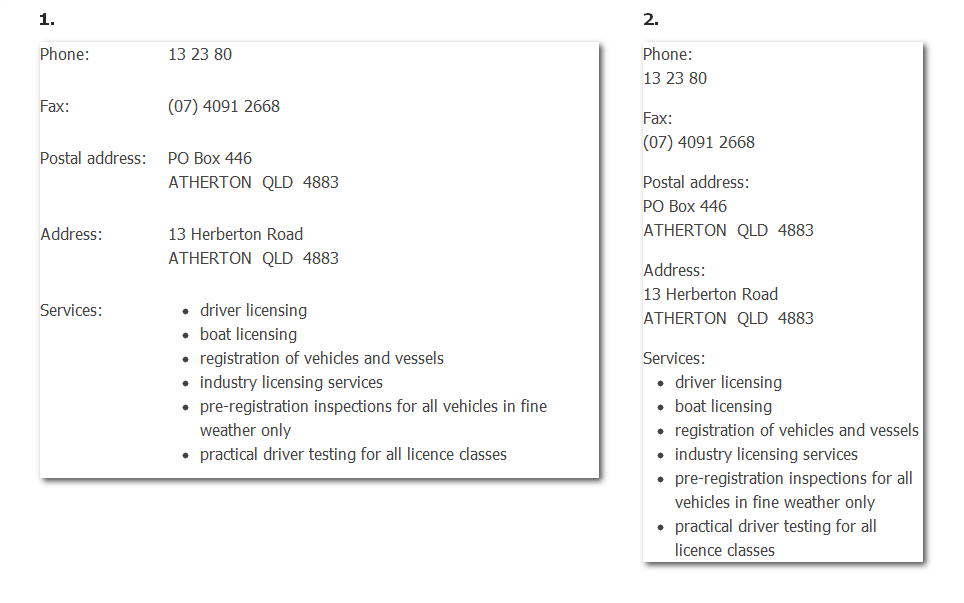

## Downloadable document link

The following approach allows the 'title' to be underlined without the 'meta' being underlined in all browsers.

**Use** `cite` **instead** of `span` **when the title is a citation of a publication name.**

Note: it is important to leave whitespace (a line break) between `span.title` and `span.meta`.

### XHTML 1.0-span
```html
<a href=".." class="download">
    <span class="title">Information Privacy Act 2009</span>
    <span class="meta">(PDF, 836KB)</span>
</a>
```
### Screenshot

### XHTML 1.0-cite
```html
<a href=".." class="download">
    <cite class="title">Information Privacy Act 2009</cite>
    <span class="meta">(PDF, 836KB)</span>
</a>
```
### Screenshot


When linking to multiple formats, use a list:
### XHTML 1.0
```html
<ul>
    <li><a href=".." class="download">
        <span class="title">Subsidy application form</span>
        <span class="meta">(PDF, 220KB)</span>
    </a></li>
    <li><a href=".." class="download">
        <span class="title">Subsidy application form</span>
        <span class="meta">(RTF, 60KB)</span>
    </a></li>
</ul>
```
### Screenshot
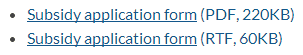

## Meta links
The following approach allows the 'title' to be underlined without the 'meta' being underlined in all browsers, same as downloadable documents above.
This can be used in more generic cases which are not downloadable documents.

Note: it is important to leave whitespace (a line break) between `span.title` and `span.meta`.
### XHTML 1.0
```html
<a href=".." class="meta-link">
    <span class="title">Primary text to be underlined</span>
    <span class="meta">(comments and other meta information)</span>
</a>
```
### Screenshot
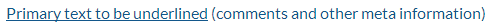

## Pull-quote
### XHTML 1.0
```html
<blockquote class="pull-quote"><p>
   Volunteers, a precious resource we can not afford to lose.
</p></blockquote>
```
### Screenshot
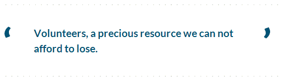

## Pull-quote with citation
### XHTML 1.0
```html
<div class="figure">
    <blockquote class="pull-quote"><p>
   Volunteers, a precious resource we can not afford to lose.
    </p></blockquote>
    <div class="figcaption">Denise Penn </div>
</div>
```
### Screenshot
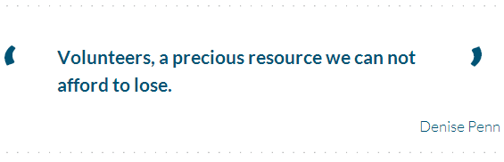

Based on [HTML5 blockquote example](https://html.spec.whatwg.org/multipage/semantics.html#the-blockquote-element)

## Video
See [Video pattern](https://govdex.gov.au/confluence/display/SSQSWE/Video+pattern)

## Contacts
Order contact details as follows:
- Name (heading)
- Phone (franchise landing pages and above must use the 13 QGOV number; index pages and below can use more specific numbers)
- Email
- Fax (if relevant)
- Website (if relevant, do not list Queensland Government websites---the customer is already on the qld.gov.au website!)
- Postal address (follow Australia Post addressing guidelines for display)
- Address---**only if** there is a counter service available to government customers.

Use [hCard](http://microformats.org/wiki/hcard)
### XHTML 1.0
```html
<div class="vcard">
<h2 class="fn org">Aboriginal and Torres Strait Islander Partnerships</h2>
<dl>
<dt>Phone:</dt>
<dd class="tel">
<span class="type">Work</span>
13 QGOV (<span class="value">13 74 68</span>)
</dd>
<dt>Email:</dt>
<dd><a href="mailto:askatsip@communities.qld.gov.au" class="email">askatsip@communities.qld.gov.au</a></dd>
<dt>Fax:</dt>
<dd class="tel">
<span class="type">Fax</span>
<span class="value">07 3224 2070</span>
</dd>
<dt>Website:</dt>
<dd><a href="http://www.communities.qld.gov.au/atsis/" class="url">www.communities.qld.gov.au/atsis/</a></dd>
<dt>Postal address:</dt>
<dd>
<span class="adr">
<span class="type">Post</span>
<span class="post-office-box">GPO Box 806</span><br />
<span class="locality">BRISBANE</span>&nbsp;
<span class="region">QLD</span>&nbsp;
<span class="postal-code">4001</span>
</span>
</dd>
<dt>Address:</dt>
<dd>
<span class="adr">
<span class="type">Work</span>
<span class="street-extended">Level 6A, Neville Bonner Building</span><br />
<span class="street-address">75 William Street</span><br />
<span class="locality">Brisbane</span>
<abbr title="Queensland" class="region">Qld</abbr>
<span class="postal-code">4000</span>
</span>
</dd>
</dl>
</div>
```
### Screenshot
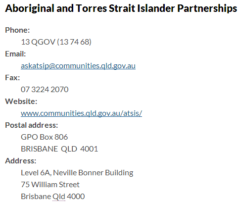

## Checklist
### XHTML 1.0
```html
<ul class="checklist">
  <li>Have you entered your birth name?</li>
  <li>Have you entered your family name?</li>
  <li>Have you entered your date of birth correctly?</li>
  <li>Have you provided your email address?</li>
  <li>Have you been to infinity and beyond?</li>
  <li>Have you ticked off everything in this checklist?</li>
</ul>
```
### Screenshot
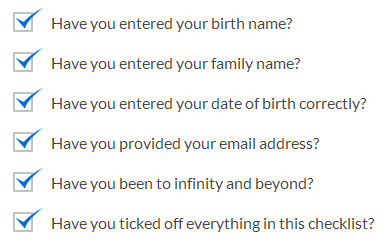

### Print styles
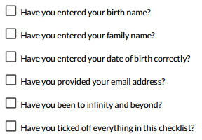

## Side-by-side comparison
### XHTML 1.0
```html
<div class="section comparison">
    …
</div>
<div class="section comparison">
    …
</div>
```
### Progressively enhanced (DHTML) to...
```html
<div><div>
    …
</div></div>
<div><div>
    …
</div></div>
```
### Screenshot
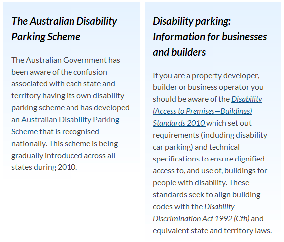

## Side-by-side comparison (advantages and disadvantages)
### XHTML 1.0
```html
<div class="section comparison advantages">
    …
</div>
<div class="section comparison disadvantages">
    …
</div>
```
### Progressively enhanced (DHTML) to...
```html
<div><div>
    …
</div></div>
<div><div>
    …
</div></div>
```
### Screenshot
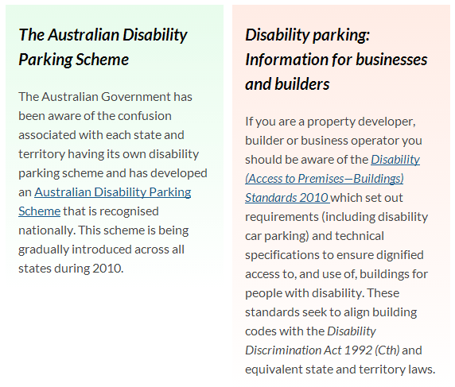

## Cross-selling links
### XHTML 1.0
```html
<div class="section" id="what-next"><div class="border">
    <h2>What can I read or do next?</h2>
    <ul>
        <li><a href="#">Weed control</a></li>
        <li><a href="#">Weed killer</a></li>
        <li><a href="#">Weeds</a></li>
    </ul>
</div></div>
```
### Screenshot
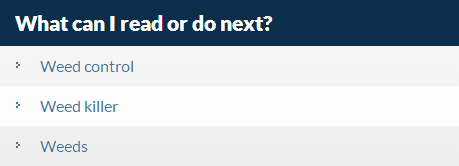

## News slideshow

A slideshow pattern is available for the news/featured section on index pages.

Each news item should have:

- a title
- short summary
- an image (284px × 113px for index pages, 373px × 189px for home page)
- a dedicated page with more information (link the image and 'More…' link to this page)

If there are more items than fit in the available space, then the slideshow will scroll between them. The slideshow will automatically play when the page loads. The slideshow can be paused on load by replacing the class `autoplay-enabled` with `autoplay-disabled`.

### HTML

```html
<div class="slide-runner autoplay-enabled">
<div id="featured-1" class="section"><h3>Tropical Cyclone Marcia</h3><a href="http://www.qldalert.com/"><span class="feature"></span></a><div class="feature-content"><p>Find out about school closures, applying for financial help and cleaning up safely.</p><p class="more"><a title="Read more about: Tropical Cyclone Marcia" href="http://www.qldalert.com/">More&hellip;</a></p></div></div>

<div id="featured-2" class="section"><h3>2015 annual land valuations</h3><a href="http://www.qld.gov.au/environment/land/title/valuation/"><span class="feature"></span></a><div class="feature-content"><p>This year's land valuation notices were issued on 4 March. Find out what they mean, how land is valued, and what to do if you don't receive yours.</p><p class="more"><a title="Read more about: 2015 annual land valuations" href="http://www.qld.gov.au/environment/land/title/valuation/">More&hellip;</a></p></div></div>

<div id="featured-3" class="section"><h3>Motorcycle road rule changes</h3><a href="http://www.qld.gov.au/transport/news/features/motorcycle-changes/index.html"><span class="feature"></span></a><div class="feature-content"><p>Road rules for fully licensed motorcycle riders have changed. Read about the changes to lane filtering, riding on road shoulders and choice of helmets.</p><p class="more"><a title="Read more about: Motorcycle road rule changes" href="http://www.qld.gov.au/transport/news/features/motorcycle-changes/index.html">More&hellip;</a></p></div></div>
</div>
```

### Screenshot

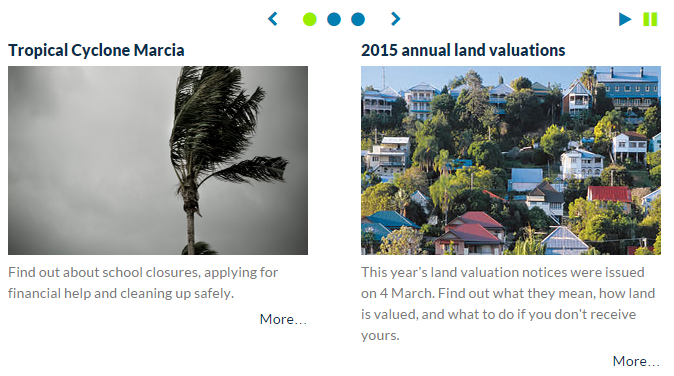
