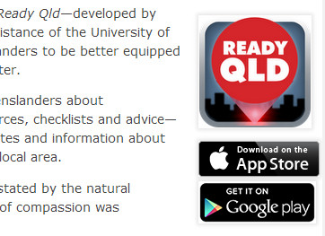

# Mobile applications (linking to)
This pattern is *currently undergoing review*. Please contact us if you need to use this pattern.

Use a cut-in within your content.
Icon should be 124px square.
* [iTunes Link Maker](http://itunes.apple.com/linkmaker/) for iPhone/iPad (iOS) apps---choose the large button (135 × 40px) 
	* [Licensing and trademarks iTunes](https://developer.apple.com/softwarelicensing/agreements/itunes.php)
	* [App Marketing and Identity Guidelines for developers (PDF)](https://developer.apple.com/app-store/marketing/guidelines/)
* [Google Play Badges](http://developer.android.com/distribute/googleplay/promote/badges.html)---choose the smallest button (129 × 45px)
	* [Google Play Brand Guidelines](http://developer.android.com/distribute/googleplay/promote/brand.html)

1. escape '&' as '&' in the iTunes link
2. remove the `target` attribute from the iTunes link
3. you can safely remove `style` setting `border: 0` from the iTunes link. Borders are removed by the qgov stylesheets.
4. append ' for iPhone/iPad' to the alt text for iTunes links: "ReadyQld by Volunteering Queensland Inc for iPhone/iPad"
5. prepend app name to android market link alt text: "ReadyQld---Available in Google Play"

### XHTML
```html
<div class="cut-in app">
    
    <ul>
        <li>
            <a href="http://itunes.apple.com/au/app/readyqld/id481034135?mt=8&amp;uo=4">
                
            </a>
        </li>
        <li>
            <a href="https://play.google.com/store/apps/details?id=au.org.volunteeringqld.readyqld">
                
            </a>
        </li>
    </ul>
</div>
```

### Screenshot

