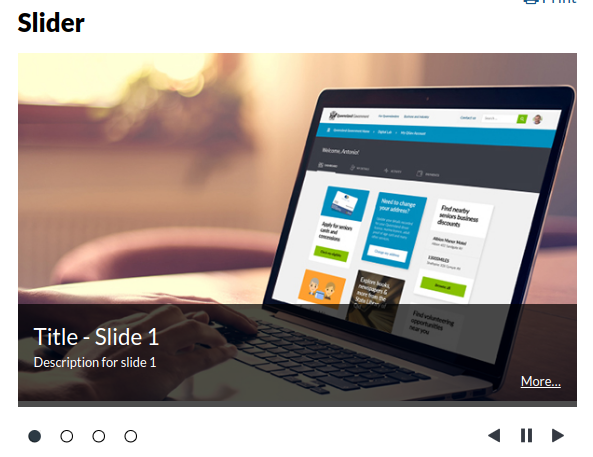

# Page slider

Accessible slider. To integrate it in content container use the html template below.

**Mandatory attributes:**
- unique id (Ex: id="custom-page-slider")
- class="news-items page-slider"
- class="section"



```html
<div id="custom-page-slider" class="news-items page-slider">
   <div class="section">
      
      <div class="slider-content">
         <h3>Title - Slide 1</h3>
         <p>Description for slide 1</p>
         <p class="more"><a href="/" title="Read more about: Slide 1">More&hellip;</a></p>
      </div>
   </div><!-- end .section -->
   <div class="section">
      
      <div class="slider-content">
         <h3>Title - Slide 2</h3>
         <p>Description for slide 2</p>
         <p class="more"><a href="/" title="Read more about: Slide 2">More&hellip;</a></p>
      </div>
   </div><!-- end .section -->
   <div class="section">
      
      <div class="slider-content">
         <h3>Title - Slide 3</h3>
         <p>Description for slide 3</p>
         <p class="more"><a href="/" title="Read more about: Slide 3">More&hellip;</a></p>
      </div>
   </div><!-- end .section -->
   <div class="section">
      
      <div class="slider-content">
         <h3>Title - Slide 4</h3>
         <p>Description for slide 4</p>
         <p class="more"><a href="/" title="Read more about: Slide 4">More&hellip;</a></p>
      </div>
   </div><!-- end .section -->
</div>
```