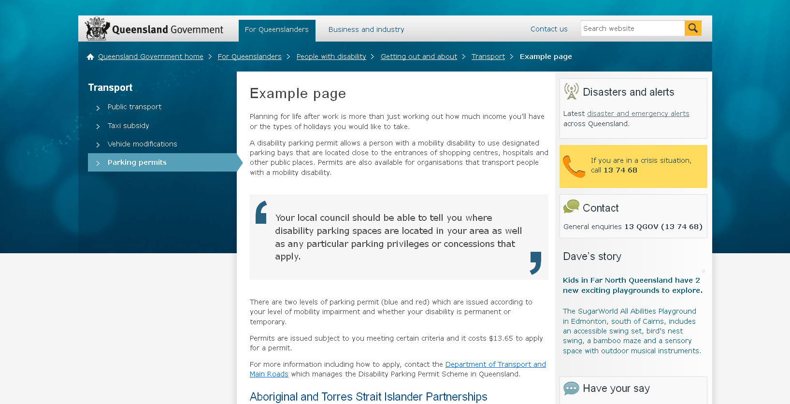

# Disaster alert aside

**Under construction**
This feature is under development and may change.

Use this aside to link a content page (or application) to the central disaster page.

## Usage
```html
<!--#include virtual="/assets/includes/global/aside-disaster-alert.html" -->
```
Place this include in the asides column.

## Screenshots
