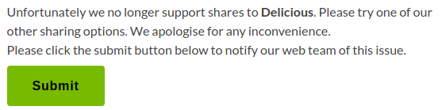

#Error handling and notify support team
A generic error handling functionality to monitor any errors occurring on a page and encourage user to notify support team about the error.

**How it works:**
- Page should contain logic to 
	- fill custom error containers with errors  (Eg; error info written in hidden <p> element)
	- trigger the error handling functionality with container information
- Plugin generates a hidden form with error information, displays submit button
- Page should display text encouraging user to click upon submit to notify support team of the occurred error
- On submit, email notification will be sent to support team via form submission handler

**Usage**

Page logic: Page should be able to identify errors, display error info in an element and trigger error handling functionality
```javascript
	if(error) {
		var $errorInfoClass = 'page -specific-error';
		$target.append($('<p/>', {class: $errorInfoClass, style: 'display: none'}).html(errorInfo)); //displays error info in a container
		if(qg && qg.swe && qg.swe.handleErrors && typeof qg.swe.handleErrors === 'function') qg.swe.handleErrors('.' + $errorInfoClass); //triggers error handling functionality i.e. qg.swe.handleErrors
	}
```
Plugin generates a hidden form accumulating all available error info and displays a submit button for enabling users to notify support ream


