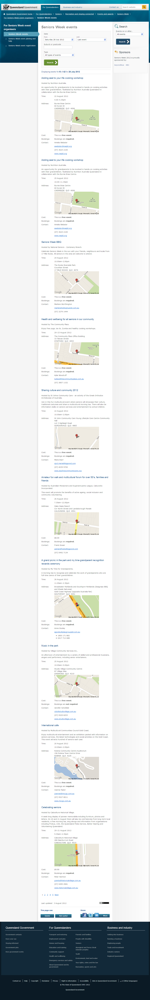

# Events from CSV datasets

Pages hosted on www.qld.gov.au may include events.

Events are presented as search results, as specified in the CUE: [Search results presentation](http://www.qld.gov.au/web/cue/module5/)

A simplified version is available for the #CSV format for upcoming events on franchise landing pages.

The dataset for events is to be a CSV file published and maintained by a franchise.

The file should be stored in your `assets/data` folder and named for the event, example: `/seniors/assets/data/seniors-week-events.csv`
- [Page model](#page-model)
- [Configuration](#configuration)
	- [CSV format for event search](#csv-format-for-event-search)
    - [CSV format for upcoming events](#csv-format-for-upcoming-events)
    - [Search parameters](#search-parameters)
    	- [Supported datasets](#supported-datasets)
        - [Sort order](#sort-order)
        - [Pagination](#pagination)
- [Examples](#examples)

## Page model
- Page title
- Event search form [OPTIONAL]
- Event listings (server-side include)
- Asides [OPTIONAL]

## Configuration
The server-side include **must** specify a dataset. Optional search parameters are supported and may be hardcoded into the page.

If a search form is provided, the parameters will be passed as a query string.

### CSV format for event search
The CSV file must contain the following columns.

The first row must contain these exact column headings.

Column | Description | Format | Required
------ | ----------- | ------ | --------
**Title** | Name of the event | Text | Required
**Description** | Short description of the event | Text (not HTML) | Required
**Start date** | Date the event starts | d/M/YYYY | Required 
**End date** | Date the event ends | d/M/YYYY | Optional (same as Start date if blank) 
**Start time** | Time the event starts | H:MM:SS (24 hour) | Optional 
**End time** | Time the event ends | H:MM:SS (24 hour) | Optional 
**Venue** | Name of venue | Text | Optional 
**Street address** | Event location | Sentence case | Optional 
**Suburb** | Town or suburb | UPPERCASE | Required 
**State** | Event location | 3-letter abbreviation, UPPERCASE | Required 
**Postcode** | Event location | 4-digit postcode | Required 
**Latitude** | Event location | Signed decimal degrees [(geocoder)](http://gmaps-samples.googlecode.com/svn/trunk/geocoder/singlegeocode.html) | Required 
**Longitude** | Event location | Signed decimal degrees [(geocoder)](http://gmaps-samples.googlecode.com/svn/trunk/geocoder/singlegeocode.html) | Required 
**Cost** | *Not in use* | `Free | Charge` | Optional 
**Cost (amount)** | Description of costs | Text | Optional (blank means free)
**Bookings** | Indicate if bookings are required | `Not required | Recommended | Required` | Required
**Type** | Type (category) of event | Text, separate multiple values with ; (semi-colon) | Optional 
**Facilities** | *Not in use* | TBA | Optional 
**Event organiser** | Name of organisation hosting the event | Text | Required 
**Given name** | First name of contact person | Text | Required
**Family name** | Surname of contact person | Text | Required
**Email** | Email address of contact person | Email address | Optional 
**Phone** | Phone number of contact person | Phone number (follow editorial style guide), separate multiple numbers with ; (semi-colon) | Optional 
**Website** | Web address (URL) for further information | URL | Optional 
**Presenter** | *proposed* Name of presenter at event | Text | Optional 
**Registration URL** | *proposed* Web address (URL) for registering online | URL | Optional 
**Registration end date** | *proposed* Date which registrations must be received by | d/M/YYYY | Optional 

Please discuss any additional requirements with the QGov Online team.

### CSV format for upcoming events
The CSV file must contain the following columns.

The first row must contain these exact column headings.

Column | Description | Format | Required
------ | ----------- | ------ | --------
**Title** | Name of the event | Text | Required
**Description** | Short description of the event | Text (not HTML) | Optional
**Start date** | Date the event starts | d/M/YYYY | Required 
**End date** | Date the event ends | d/M/YYYY | Optional (same as Start date if blank) 
**Start time** | Time the event starts | H:MM:SS (24 hour) | Optional 
**End time** | Time the event ends | H:MM:SS (24 hour) | Optional 
**Venue** | Name of venue | Text | Optional 
**Website** | Web address (URL) for further information | URL | Optional 

Please discuss any additional requirements with the QGov Online team.

### Search parameters
A date range is always used in the search results. By default, all events that occur from today onwards are included (past events are hidden). This includes events that started before the current day and are still running.

Parameter | Description | Format | Default value
--------- | ----------- | ------ | -------------
dataset | Identifies which CSV source file to use. You must contact the QGov Online team to configure new datasets. | Text (see supported datasets) below) | - 
date | Start date | dd/MM/YYYY | Defaults to the current date (past events are excluded) 
until | End date | dd/MM/YYYY | No default (all future events are shown)
location | An address of a location. If specified, only events falling within a 50km radius will be included. | A string which can be geocoded by google | - 
type | A type (category) of event. Types can be configured per dataset. If you are using a search form, contact the QGov Online team to create a form with the correct types listed. | A text label, example: `Open day` | - 

#### Supported datasets
- seniors-week
- disability-action-week

Contact the QGov Online team to add your dataset.

#### Sort order
The sort order of the CSV file is preserved. It is strongly recommended that the CSV file be sorted by date.

If a location is specified, search results will be sorted by proximity (events nearest the search location will appear first).

#### Pagination
Results are paginated as specified in the CUE: [Pagination - Search results presentation](http://www.qld.gov.au/web/cue/module5/checkpoints/checkpoint15/)

## Examples
Include all 'Open day' events from the Seniors Week event listing
```html
<!--#include virtual="/assets/includes/dynamic/events/csv.php?type=Open+day&dataset=seniors-week" -->
```

Include all seniors week events matching the search criteria:
```html
<!--#include virtual="/assets/includes/dynamic/events/csv.php?${QUERY_STRING}&dataset=seniors-week" -->
```

Create the upcoming events aside for Education and training franchise landing page"
```html
<div class="aside events">
  <div class="section-header">
    <h2>Upcoming events</h2>
  </div>
  <!--#include virtual="/assets/includes/dynamic/events/upcoming.php?dataset=education-events" -->
</div>
```


