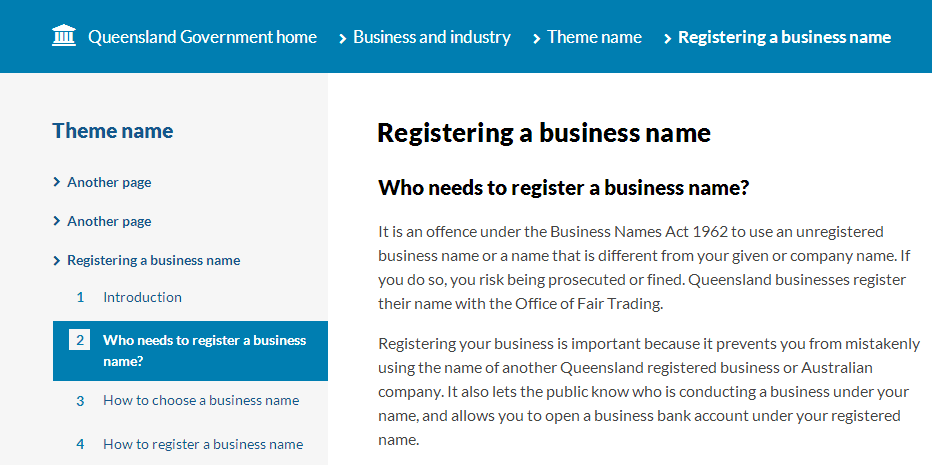
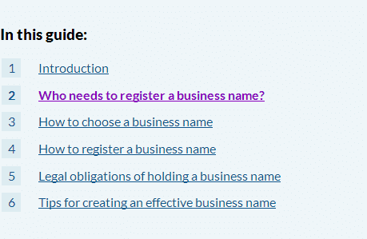
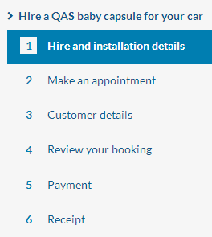
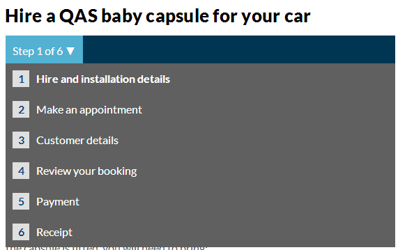

# Guide pages

- [Guide headings](#guide-headings)
- [Guide table of contents](#guide-table-of-contents)
- [Process menu (applications)](#process-menu-applications)
- [Pagination](#pagination)

When creating a pages within a 'guide', you will need to remember three key differences to a normal content page:

 1. Breadcrumbs should list the **guide name only** on all pages within a guide.
 2. Headings should be setup as below (see **Guide headings**).
 3. Include a table of contents at the bottom of the page. The template script will automatically duplicate it into the left section navigation (see **Guide table of contents**).

## Guide headings
### XHTML 1.0
```html
<h1>Guide name</h1>
 
<!--#include virtual="/assets/includes/global/page-options-pre.html"-->
 
<h2>Page name within guide</h2>
```
### Screenshot


## Guide table of contents
### XHTML 1.0
```html
<div class="border">
<h3 >In this guide:</h3>
<ol>
      <li><a href="/disability/families-carers-friends/finding-out"><span class="page-number">1</span><span class="link-text">My child has a disability: what now?</span></a></li>
    <li><a href="/disability/families-carers-friends/finding-information"><span class="page-number">2</span><span class="link-text">Gathering information</span></a></li>
      <li><a href="/disability/families-carers-friends/finding-services/"><span class="page-number">3</span><span class="link-text">Accessing services</span></a></li>
      <li><a href="/disability/families-carers-friends/finding-support/"><span class="page-number">4</span><span class="link-text">Support for parents</span></a></li>
      <li><a href="/disability/families-carers-friends/finding-plans/"><span class="page-number">5</span><span>Ongoing support and planning</span></a></li>
</ol>
</div>
```
### Screenshot


## Process menu (applications)
### XHTML 1.0
```html
<div class="nav-section"><div class="box-sizing"><ul>...<li class="current-page has-submenu"><a href="/services/carbabyseats/hire/">Hire a QAS baby capsule for your car</a><ol>
    <li><a href="/services/carbabyseats/hire/"><span class="page-number">1</span>Hire and installation details</a></li>
    <li><a href="/services/carbabyseats/place/"><span class="page-number">2</span>Make an appointment</a></li>
    <li class="current"><a href="/services/carbabyseats/customer/"><span class="page-number">3</span>Customer details</a></li>
    <li class="future"><a><span class="page-number">4</span>Review your booking</a></li>
    <li class="future"><a><span class="page-number">5</span>Confirmation</a></li>
</ol></li>...</ul></div></div>
```
### Screenshot


The process menu will be duplicated as a drop-down menu at the top of each service page. 



- use *class="future"* for items the user cannot visit yet
- remove *@href* from items the user cannot visit yet, but keep the ```html<a>``` tag

## Pagination

Place this immediately after the table of contents (shown above) at the end of the article, as marked by these closing tags: ```html</div></div></div><!-- end .article, .box-sizing, .border -->```
### XHTML 1.0
```html
<ul class="pagination">
    <li class="previous"><a href="business-name-1.html">Previous</a></li>
    <li class="next"><a href="business-name-3.html">Next</a></li>
</ul>
```
### Screenshot


