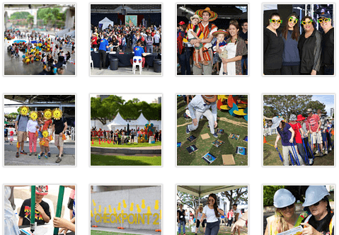
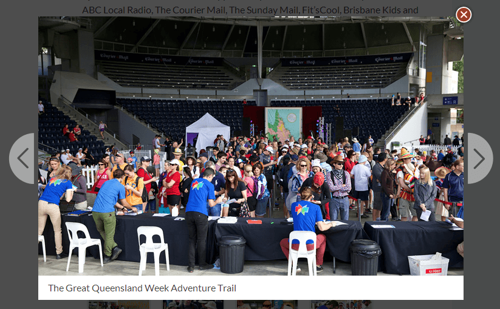

# Lightbox
A lightbox is a user interface (UI) pattern that displays content inside of a popup layer superimposed over the top of the current page (the current page is still visible under a dark translucent overlay).

An accessible lightbox has been integrated with the template and can be invoked in a number of predefined situations.

**Important:**
 * If you would like to use a lightbox for a different situation, please contact the Smart Service core team Product Manager to discuss adding the new use case to the template
 * Please don't use the following hooks for situations other than the ones intended. If you do misuse them, we can't guarantee that they will continue to work as expected (e.g. the approach for presenting definitions may change in ways that are appropriate for definitions, but not for your situation).

 **Lightbox examples:**
 * [The Great Queensland Week Adventure Trail Photo Gallery](https://www.qld.gov.au/about/events-awards-honours/events/queensland-week/adventure-trail/)
 * [Queensland Greats Awards Photo Gallery](www.qld.gov.au/about/events-awards-honours/awards/qld-greats-awards/photo-gallery/)

## Images
Any link directly to an image will display the image in a lightbox and use the title attribute on the link as a caption for the displayed image.

### XHTML 1.0
```html
<a href="/path/to/my/image.jpg"
title="If you can read this, you are probably looking at a lightbox caption">
    The image name (or a thumbnail image)
</a>.
```

## Image gallery
An image gallery can be put together using the following markup. Each thumbnail image should be 100 x 100 pixels.

### XHTML 1.0
```html
<div class="section image-gallery">
<h2>Gallery title</h2>
<p>Gallery introduction (if required).</p>
<ul>
  <li><a href="photo-1.jpg" title="Title text for the image (this becomes the caption)">
    
  </a></li>
  <li><a href="photo-2.jpg" title="Title text for the image (this becomes the caption)">
    
  </a></li>
</ul></div>
```

### Screenshot



## Definition
If a term or concept has been defined elsewhere on the page or on another page, you can display the definition block in a lightbox as follows:

### XHTML 1.0
Either a block from the same page:
```html
<a class="definition" href="#queenslander">queenslander</a>
```
Or from another page:
```html
<a class="definition" href="definitions/#queenslander">queenslander</a>
```
The definition block should be marked up as:
### XHTML 1.0
```html
<div class="section" id="queenslander">
  <h2>Queenslander</h2>
  <p>Definition here (can contain lists or tables etc if necessary).</p>
</div>
```

## Map
External maps can be displayed in an iframe lightbox using the following snippet.

Please discuss with the Smart Service core team Product Manager before using this approach (for other map integration and accessibility considerations).

### XHTML 1.0
```html
<a href="http://external-map-provider.com/the-map/" class="map">The map name or a thumbnail image</a>
```
