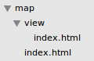

# Maps
## Summary
When user wants to display map and search results in their page but do not want to develop from scratch, QLD SWE assets provides a plugin which can be used to build map and display search results dynamically. 
User can use default map or can configure via SSI includes and data attributes which suits their requirement.
 
This document describes how user can use the plugin to display maps and search results in their page

## Key requirements
User would need 
- Data in CSV file uploaded in [Data Portal](https://data.qld.gov.au/)
- A folder structure as shown in the image below
  - map/index.html → would contain code to display map and search results. It can also contain form if end-user needs to filter data
  - map/view/index.html → would contain code to view complete details of one search result
  

## Usage
### How to display Map & Search results
Include following code in your map/index.html. Make sure the text within the curly braces match the column names in your csv data.
```
<!--#include virtual="/assets/includes/dynamic/maps/map-template.html"-->
<form action="" method="get">
  <ol class="questions">
     <li>
        <label for="location">
           <span class="label">Suburb or postcode</span>
        </label>
        <input type="text" id="location" name="location" size="30" value="" />
        <em><input type="submit" value="Search" /></em>
     </li>
  </ol>
</form>
<a id="data-url" data-zoom="5" data-center="-20,146" data-set="" data-controlsposition="TOP_RIGHT" data-clustergridsize="30" data-url="https://data.qld.gov.au/dataset/q-ride-providers/resource/0647759d-9f68-44f9-bd7e-eb96d37d11e4" data-strictbounds="true" data-location=" , QLD" data-orderby="Title">View full Data</a>
<div id="search-results-container">
    <h2 class="resultset-title"></h2>
        <ol id="search-results">
            <li>
                [[<h3><a href="view/?title={{Title}}"><u>{{Title}}</u></a></h3>]]
                [[{{streetAddress:Address 1|Address 2|Suburb|Postcode}}]]
                [[<br />{{Phone}}]]
                [[<br />{{md:Website}}]]
                <hr/> 
            </li>
        </ol>
    <div class="pagination"></div>
</div>
 
 
<!--Additional comments explaining template
//<div id="search-results-container">,<h2 class="resultset-title"></h2>,<ol id="search-results">,<div class="pagination"></div> are important to run the script
//Square brackets implies, display content enclosed in square brackets only if content enclosed in curly brackets exists
//Curly brackets would be the column names of your csv file. -->
```
####  How to customise via SSI includes or data-attributes
Following table describes the SSI/ HTML element configuration

<table>
	<thead>
	<tr>
		<th>Display</th>
		<th >Include/ HTML Element</th>
		<th>What it does</th>
	</tr>
	</thead>
	<tbody>
	<tr>
		<td >Map</td>
		<td ><pre>&lt;!--#include virtual="/assets/includes/dynamic/maps/map-template.html"--&gt; </pre></td>
		<td >
			<p>Wherever this include is on the page, Map canvas will be generated</p>
			<p>This include has class="qgov-maps" which is key to run scripts</p>
		</td>
	</tr>
	<tr>
		<td >Form</td>
		<td >
			<p><strong>Default Template</strong>:<pre> &lt;!--#include virtual="/assets/includes/dynamic/maps/search-form.html"--&gt;</pre></p>
			<p><strong>Custom Template: </strong>Any custom form</p>
		</td>
		<td >
			<p>After form submit, the data is filtered based on the values entered in form.</p>
			<p>"name" attribute of the form fields should match column name in data.</p>
		</td>
	</tr>
	<tr>
		<td >Data Element</td>
		<td ><pre>&lt;a id="data-url" data-zoom="5" data-center="-20,146" data-set="" data-controlsposition="TOP_RIGHT" data-clustergridsize="30" <br>data-url="https://staging.data.qld.gov.au/dataset/test-mapping/resource/4fb8135b-ae12-4e95-9d29-e59e9c31fe72" data-strictbounds="true"&gt;View full Data&lt;/a&gt;</pre></td>
		<td >Data from the mentioned data-url will be fetched and displayed in the search results. More information on its configuration is given in the table below.</td>
	</tr>
	<tr>
		<td >Search results</td>
		<td>
			<p><strong>Default Template</strong>: <pre>&lt;!--#include virtual="/assets/includes/dynamic/maps/search-result.html"--&gt;</pre></p>
			<p><strong>Custom Template: </strong></p>
			<pre>
&lt;div id="search-results-container"&gt;
&nbsp;&nbsp;&nbsp;&nbsp;&lt;h2 class="resultset-title"&gt;&lt;/h2&gt;
&nbsp;&nbsp;&nbsp;&nbsp;&lt;ol id="search-results"&gt;
&nbsp;&nbsp;&nbsp;&nbsp;&nbsp;&nbsp;&nbsp;&nbsp;&lt;li&gt;
&nbsp;&nbsp;&nbsp;&nbsp;&nbsp;&nbsp;&nbsp;&nbsp;&nbsp;&nbsp;&nbsp;&nbsp;[[&lt;h3&gt;&lt;a href="view/?title={{Title}}"&gt;&lt;u&gt;{{Title}}&lt;/u&gt;&lt;/a&gt;&lt;/h3&gt;]]
&nbsp;&nbsp;&nbsp;&nbsp;&nbsp;&nbsp;&nbsp;&nbsp;&nbsp;&nbsp;&nbsp;&nbsp;[[{{streetAddress:Address 1|Address 2|Suburb|State|Postcode}}]]
&nbsp;&nbsp;&nbsp;&nbsp;&nbsp;&nbsp;&nbsp;&nbsp;&nbsp;&nbsp;&nbsp;&nbsp;[[&lt;br /&gt;{{Phone}}]]
&nbsp;&nbsp;&nbsp;&nbsp;&nbsp;&nbsp;&nbsp;&nbsp;&nbsp;&nbsp;&nbsp;&nbsp;[[&lt;br /&gt;{{Mobile1}}]]
&nbsp;&nbsp;&nbsp;&nbsp;&nbsp;&nbsp;&nbsp;&nbsp;&nbsp;&nbsp;&nbsp;&nbsp;[[&lt;br /&gt;{{Mobile2}}]]
&nbsp;&nbsp;&nbsp;&nbsp;&nbsp;&nbsp;&nbsp;&nbsp;&nbsp;&nbsp;&nbsp;&nbsp;[[&lt;br /&gt;{{md:Website}}]]
&nbsp;&nbsp;&nbsp;&nbsp;&nbsp;&nbsp;&nbsp;&nbsp;&nbsp;&nbsp;&nbsp;&nbsp;[[&lt;br /&gt;&lt;br /&gt;&lt;strong&gt;Area serviced:&lt;/strong&gt;&amp;nbsp;{{Area serviced}}&lt;br /&gt;]]
&nbsp;&nbsp;&nbsp;&nbsp;&nbsp;&nbsp;&nbsp;&nbsp;&nbsp;&nbsp;&nbsp;&nbsp;&lt;hr/&gt;&nbsp;
&nbsp;&nbsp;&nbsp;&nbsp;&nbsp;&nbsp;&nbsp;&nbsp;&lt;/li&gt;
&nbsp;&nbsp;&nbsp;&nbsp;&lt;/ol&gt;
&nbsp;&nbsp;&nbsp;&nbsp;&lt;div class="pagination"&gt;&lt;/div&gt;
&lt;/div&gt;
			</pre>
			<p><strong>Custom Template via data attribute: </strong></p>
            <p>The above custom template can also be saved as a separate html file and can be used by attaching its relative path to the Data Element.</p>
            <pre>&lt;a id="data-url" data-search-template="{RELATIVE-PATH}" data-zoom="5" data-center="-20,146" data-set="" data-controlsposition="TOP_RIGHT" 
data-clustergridsize="30" data-url="https://staging.data.qld.gov.au/dataset/test-mapping/resource/4fb8135b-ae12-4e95-9d29-e59e9c31fe72" 
data-strictbounds="true"&gt;View full Data&lt;/a&gt;</pre>
		</td>
		<td>
			<p>Data will be processed and displayed in the format described in the template.</p>
			<p>Value inside curly braces should be column name in data {{COLUMN-NAME}} </p>
		</td>
	</tr>
	</tbody>
</table>

Following table describes the data attribute configuration

Attribute | Mandatory/Optional | Values |  Default Value | Definition
----------------- | -------- | ------------| -------- | ------------
data-url |	mandatory | url |	| url to csv file in data.qld.gov.au
data-zoom |	optional |	integer |	10 |	defines zoom size of map after search submit
data-center |	optional |	lat,long |	-23,143 |	defines the center of map on page load
data-set |	optional	| qgap, housing-service-centres, scd | |
data-controlsposition |	optional |	BOTTOM, BOTTOM_CENTER, BOTTOM_LEFT, BOTTOM_RIGHT, CENTER, LEFT, LEFT_BOTTOM, LEFT_CENTER, LEFT_TOP, RIGT, RIGHT_BOTTOM, RIGHT_CENTER, RIGHT_TOP, TOP, TOP_CENTER, TOP_LEFT, TOP_RIGHT |	RIGHT_BOTTOM |	defines the position of map controls like street view contol, zoom control, etc.
data-clustergridsize |	optional	| | integer |	defines area in pixels should form a cluster
data-strictbounds |	optional |	true/false |	true, i.e. returns locations confined to Qld |	If you donot want autocomplete location to return results confined to Qld, set this value to false
data-search-template |	optional | | |url to template you would like to display your search results
data-location |	optional |	string (example : " , QLD")	| |in location input field, when user enters location, the input field will be appended by the value given.<br>For example, if data-location= ", QLD", and user enters "Richmond" in location input field, the value will be altered to "Richmond, QLD"
data-orderby | optional | string (example: "Title") |   | search results will be displayed ordered by data-orderby value.<br>This value should be column name in data

You can also include following pre-defined templates
 - /assets/includes/dynamic/map/search-result.html
 - /assets/includes/dynamic/map/search-result-qgap.html
 - /assets/includes/dynamic/map/search-result-housing-service-centres.html

### User guide on data format in CSV files
**Notes on operating hours for counters like QGAP, Housing centers etc**
If a counter is open all day, simply put the opening time in the am column for that day and the closing time in the pm column. Example: 8:30, 17:00
If a counter closes during a lunch period, specify a range in the am and pm columns. Example: ```8:30-12:00, 13:00-17:00```
If a counter is open in the morning and closed for the afternoon, put a range in the am column and leave the pm column blank. Example: ```8:30-12:00```,
Specify the normal operating hours for the counter. It is assumed counters will be closed on Queensland and local public holidays.
Closure dates can be specified as a range. Separate multiple values with semi-colons. ```Example: 24/12/2012-1/1/2013; 1/2/2013``` means closed from 24 December 2012 through to 1 January 2013 (inclusive) and closed again on 1 February 2013. Only closures that are happening within the next 5 weeks will be displayed on the page.
Custom (free text) messages can be included in the closure column. Example: ```after 1.30pm on 27, 28 and 31 December 2012```. Note: custom messages will always be displayed as the script cannot reliably determine the date of the closure.
To remove a custom message, update your CSV file.
Closure messages are displayed as text, with the lead-in phrase ‘We are closed’. Examples:

Closure data type | CSV data | Displayed as 
----------------- | -------- | ------------
Date range |	24/12/2012-1/1/2013 |	We are closed 24 December 2012--1 January 2013.
Custom |	after 1.30pm on 27, 28 and 31 December 2012 |	We are closed after 1.30pm on 27, 28 and 31 December 2012.
Multiple dates |	24/12/2012-26/12/2012; 28/12/2012-1/1/2013 |	We are closed 24-26 December 2012 and 28 December 2012-1 January 2013.
Mixed |	24/12/2012-26/12/2012; after 1.30pm on 27, 28 and 31 December 2012; 1/1/2013 |	We are closed 24--26 December 2012, after 1.30pm on 27, 28 and 31 December p2012 and 1 January 2013.

Please discuss any additional requirements with the QGov Online team.

## How to display view search result
Include following code in your map/view/index.html. Make sure the text within the curly braces match the column names in your csv data.
```

<a id="data-url" class="view-result"  data-title-column="Title" data-set="housing-service-centres" data-url="https://data.qld.gov.au/dataset/contact-a-housing-service-centre/resource/e29680e4-a5a1-4cdf-b24d-30b4f4dff307" data-strictbounds="true"></a>


<div id="view-contact-info" class="view-csv-data visuallyhidden">
	<div>[[<div class="status info"><h2>Attention</h2><p>{{Notes}}</p></div>]]</div>
	<div>
		<dl class="grid">
			[[<dt>Email:</dt><dd><a href="mailto:{{Email}}">{{Email}}</a></dd>]]
		    [[<dt>Phone:</dt><dd>{{md:Phone}}</dd>]]
		    [[<dt>Fax:</dt><dd>{{Fax}}</dd>]]
		    <dt>Address:</dt><dd class="location adr">[[{{Address 1}}]] [[<br> {{Address 2}}]] [[<br> {{Suburb}}]] Qld [[{{Postcode}}]]</dd>
		    [[<dt>Services:</dt><dd>{{Services}}</dd>]]
		</dl>
	</div>
</div>


<!--//Additional comments explaining template
//Square brackets implies, display content enclosed in square brackets only if content enclosed in curly brackets exists
//Curly brackets would be the column names of your csv file. -->

```
### How to customise via SSI includes or data-attributes
Following table describes the SSI/ HTML element configuration
<table>
	<thead>
	<tr>
		<th>Display</th>
		<th>HTML Element</th>
		<th>What it does</th>
	</tr>
	</thead>
	<tbody>
	<tr>
		<td>Data Element</td>
		<td><pre>&lt;a id="data-url" class="view-result"  type="hidden" data-title-column="Title" data-set="housing-service-centres" <br>data-url="https://data.qld.gov.au/dataset/contact-a-housing-service-centre/resource/e29680e4-a5a1-4cdf-b24d-30b4f4dff307" data-strictbounds="true"&gt;&lt;/a&gt;</pre></td>
		<td><p>class="view-result" is key to run scripts</p>
			<p>Data from the mentioned data-url will be fetched and displayed in the view result. More information on its configuration is given in the table below.</p>
		</td>
	</tr>
	<tr>
		<td>View Result</td>
		<td>
			<p>Template:</p>
			<pre>&lt;div id="view-contact-info" class="view-csv-data visuallyhidden"&gt;
	&lt;div&gt;[[&lt;div class="status info"&gt;&lt;h2&gt;Attention&lt;/h2&gt;&lt;p&gt;{{Notes}}&lt;/p&gt;&lt;/div&gt;]]&lt;/div&gt;
	&lt;div&gt;
		&lt;dl class="grid"&gt;
			[[&lt;dt&gt;Email:&lt;/dt&gt;&lt;dd&gt;&lt;a href="mailto:{{Email}}"&gt;{{Email}}&lt;/a&gt;&lt;/dd&gt;]]
		    [[&lt;dt&gt;Phone:&lt;/dt&gt;&lt;dd&gt;{{md:Phone}}&lt;/dd&gt;]]
		    [[&lt;dt&gt;Fax:&lt;/dt&gt;&lt;dd&gt;{{Fax}}&lt;/dd&gt;]]
		    &lt;dt&gt;Address:&lt;/dt&gt;&lt;dd class="location adr"&gt;[[{{Address 1}}]] [[&lt;br&gt; {{Address 2}}]] [[&lt;br&gt; {{Suburb}}]] Qld [[{{Postcode}}]]&lt;/dd&gt;
		    [[&lt;dt&gt;Services:&lt;/dt&gt;&lt;dd&gt;{{Services}}&lt;/dd&gt;]]
		&lt;/dl&gt;
	&lt;/div&gt;
&lt;/div&gt;</pre>
		</td>
		<td>
			<p>It is important to have class="view-csv-data" to every &lt;div&gt; that is a template.</p>
			<p>Value inside curly braces shoult be column name in data {{COLUMN-NAME}} </p>
			<p>Data will be processed to display according to the format described in templates	</p>
		</td>
	</tr>
	</tbody>
</table>

Following table describes the data attribute configuration

Attribute |	Mandatory/Optional |	Values |	Default Value |	Definition
----------|------------------- |-----------|------------------|-----------
data-url |	mandatory |	url	 | |url to csv file in data.qld.gov.au
data-title-column |	mandatory | | |Column name in which application should look for search term i.e. ?title='value
data-set |	optional | qgap, housing-service-centres, scd | |

You can also include following pre-defined templates
- /assets/includes/dynamic/maps/view-closure.html
- /assets/includes/dynamic/maps/view-contact-info.html
- /assets/includes/dynamic/maps/view-opening-hours.html
- /assets/includes/dynamic/maps/view-static-map.html
