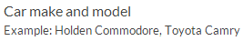
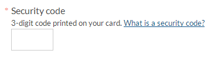
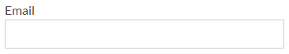
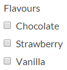
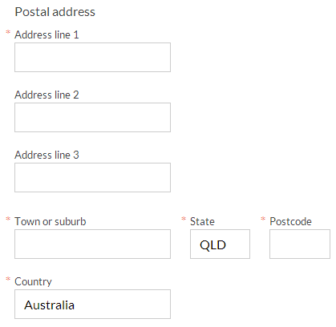
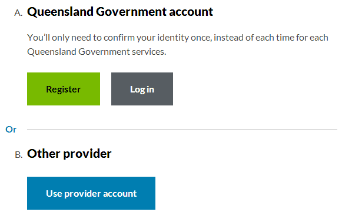
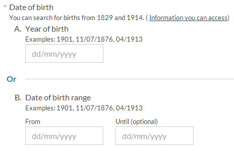
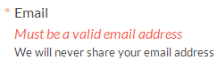
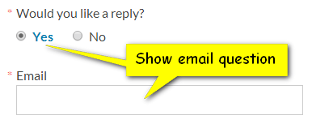
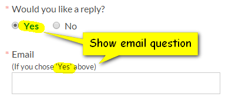

# News based on XML feeds

The [product definition](https://govdex.gov.au/confluence/display/SSQSWE/Styles+and+standards) outlines page models for publishing News items to a franchise on www.qld.gov.au

The preferred solution for publishing is to send an (Atom) XML feed. This approach means:
- A single source of truth for news items in a standard format
- News items can be easily syndicated elsewhere (like the www.qld.gov.au homepage)
- Reduces redundant effort for franchise teams as the feed can be automatically used to populate the slideshow on the franchise landing page, the contents of the news archive page, and the section navigation menus on news item pages.

# Patterns for web forms

- [Structure of a form](#structure-of-a-form)
	- [Title](#title)
    - [Status](#status)
    	- [Validation messages](#validation-messages)
    - [Preamble](#preamble)
    - [List of questions](#list-of-questions)
    - [Actions](#actions)
- [Questions](#questions)
	- [Question prompts](#question-prompts)
    	- [Hints](#hints)
        - [Help](#help)
    - [Answers](#answers)
    	- [Short text answers](#short-text-answers)
        - [Selecting from a list of choices](#selecting-from-a-list-of-choices)
        	- [Please select](#please-specify)
            - [Other, please specify](#other-please-specify)
        - [Radio buttons and checkboxes](#radio-buttons-and-checkboxes)
        - [Groups](#groups)
        - [Collecting personal information](#collecting-personal-information)
        	- [Autofill](#autofill)
        - ["Either or" questions](#either-or-questions)
    - [Accessible labels](#accessible-labels)
- [Progressive disclosure](#progressive-disclosure)
	- [Showing sections of a form one at a time (e.g. step-by-step wizard)](#showing-sections-of-a-form-one-at-a-time-e.g.-step-by-step-wizard)
    - [Hiding irrelevant questions](#hiding-irrelevant-questions)
- [Client-side validation](#client-side-validation)
	- [Validation techniques](#validation-techniques)
    	- [Example: email address must be a .qld.gov.au address](#example-email-address-must-be-a-qld.gov.au-address)
        - [Required checkboxes](#required-checkboxes)
    - [HTML5 input type notes](#html5-input-type-notes)
    - [HTML5 constraint validation API notes](html5-constraint-validation-api-notes)
- [References](#references)

## Structure of a form
A form is a preamble (opening instructions), list of questions (e.g. What is your name? What is your email address?), and one or more actions to make (e.g. 'Submit form').

### Title

### Status
The status of a form is not usually shown when a customer first opens the page. It is used when the user is returned to the form, providing information on why and what steps they need to take next. Often this is a summary of invalid answers that need to be corrected. It may also be server-side errors (for example, an error sending the email from an email form).

#### Validation messages
Briefly describe the action the customer should take to correct each error before they submit the form again. Use positive language (focus on the solution, not the problem).
Validation constraint | Suggested message | Notes
--------------------- | ----------------- | -----
Required field is blank | Must be completed | - 
Data is in the wrong format | Must be a valid *email address* | Use when the format is unambiguous (e.g. email) 
" | Must be a valid date in the format dd/mm/yyyy | Use when a specific format is required (e.g. date). If multiple formats are accepted, choose one (and only one) to display. Please also include this format as an example using a [hint](#hints) on the question. 
Value outside range limits | Must be a year between 1829 and 1914 | Use for year ranges (e.g. historical searching) 
" | You must be over 18 years old | Use for eligibility criteria combined with a date of birth field 
" | Must be more than 7 / Must be less than 6 | Use for specific ranges 

The above options are a guide only. Use messages that work for your customers. You may find it helpful to write new messages following the 'Must be __________' format (rephrase them if they sound awkward).

### Preamble
The instructions at the beginning of the form are the *preamble*.

### List of questions
A form is a list of questions. Use an ordered list.
A "question" may include one or more form controls. If multiple controls are included, use a fieldset.
```html
<ol class="questions">
    <li>… question1 …</li>
    <li>… question2 …</li>
    <li>… question3 …</li>
    <li class="footer">… actions …</li>
</ol>
```
Forms may be divided into multiple sections.
Individual questions can be grouped.

### Actions
The last 'question' in a form is which action to be taken. There should be one (and only one) *primary action* per form. Primary actions should have a distinct style.
Secondary actions may be presented as buttons or links. Actions should be presented as a list.
#### XHTML
```html
<ul class="actions">
    <li><strong><input type="submit" value="Primary alt" /></strong></li>
    <li><input type="submit" value="Secondary" /></li>
    <li><a href="#" class="button">Link button</a></li>
    <li><a href="#">Cancel</a></li>
</ul>
```

#### Screenshot

Notes:
- buttons can be: `input[type="submit"], button` or `a.button`
- to style a link as a button, use `class="button"`
- to create a primary action (green button), surround the button with `<strong>` tags
- an alternate "blue" primary action is available, replacing `<strong>` with `<em>`. Guidelines for when to use the alternate style are to be determined, please contact the QGov product manager if you wish to use this style. Note that the alternate primary action style is *not to be used for secondary actions* (which are usually grey).

## Questions
By ‘question’ we mean the question (prompt) and answer. We (the authors of the form) ask the question, the customer answers.

### Question prompts
Use a `label` or `legend` for the question. Questions do not need to literally phrased as questions, often a simple prompt is fine (e.g. "Email").
Do not include a colon at the end of a prompt. Do include a question mark '?' if your prompt is phrased as a question.
Correct usage | Incorrect usage | Explanation
------------- | --------------- | -----------
Email | What is your email address | Use a simple prompt where possible 
Email | Email: | Do not include a colon on prompts 
How many baby capsules do you need to hire? | How many baby capsules do you need to hire | Include a question mark on questions 

#### Hints
Hints are optional. Use hint text to provide inline help and instructions that help the customer understand and answer the question.
##### XHTML
```html
<label for="car-make-model">
    <span class="label">Car make and model</span>
    <small class="hint">Example: Holden Commodore, Toyota Camry</small>
</label>
```
##### Screenshot

Useful for:
- displaying required data formats (we recommended you use an example). If you support multiple data formats, display the most common one—**do not** describe them all.
- displaying example data.
- short instructions.
- links to more detailed help.

#### Help
Questions should be designed so customers can easily answer them. We should not expect customers to read help, but it can be provided when useful.
Help content must be published in either an [aside](https://github.com/qld-gov-au/pattern-library/blob/master/source/content-types/asides/asides.md) on the form itself, or in a separate page.

You can link to help within a hint. The hint text should try to provide enough information if possible, with the help link providing supplemental and more detailed information. Links to help should use a class of `help`.

We recommend that help links open in a lightbox.
##### XHTML
```html
<label for="card-security-code">
    <span class="label">Card security code</span>
    <small class="hint">
        3- or 4-digit code on the back of your card.
        <a class="help" href="help.html#csc">What is a card security code?</a>
    </small>
</label>
```
##### Screenshot


### Answers
Answers may be free text, selecting from a list of choices, or broken down into a series of smaller questions or input (e.g. a date split into day, month and year boxes).

#### Short text answers
##### XHTML
```html
<li>
    <label for="email">
        <span class="label">Email</span>
    </label>
    <input type="email" name="email" id="email" size="40" />
</li>
```
##### Screenshot


#### Selecting from a list of choices
You can use radio buttons, drop-down lists and checkboxes to let customers select values from a controlled list.
If the customer can select more than one item, use checkboxes.
Question | Recommended | Explanation
-------- | ----------- | -----------
Country | drop-down list | The list of countries is very long, and the customer does not need to see all the options to understand the question 
Satisfaction scale | radio buttons | Seeing all the options helps answer the question; there should not be too many options 
Closed questions (yes or no answer) | radio buttons | Only 2 options, make them both visible 
If the customer can only select one of the answers provided, radio buttons and drop-down lists both work. If there are lots of options (more than 7), a drop-down list is neater. However, if the question is easier to understand when you review the available options, using radio buttons makes them visible and this is easier to use.

##### Please select
The first option in the list may be a prompt to make a selection. It should be labelled 'Please select…' and use the class 'placeholder'.
```html
<option class="placeholder" value="">Please select&hellip;</option>
```

##### Other, please specify
We have not documented a pattern for this yet.
1. Other option, show a text field labelled "Please specify"
2. Combo-box, `input` linked to HTML5 `datalist` for suggestions as you type (HTML5 browsers only, polyfill TBD)

#### Radio buttons and checkboxes
Radio buttons and checkboxes require different markup for accessibility. This is because each choice uses it's own `input` and `label` elements, so the group must use a `fieldset`.
##### XHTML
```html
<li>
    <fieldset>
        <legend>
            <span class="label">Flavours</span>
        </legend>
        <ul class="choices">
            <li>
                <input type="checkbox" name="flavours" value="Chocolate" id="flavours-chocolate" />
                <label for="flavours-chocolate">Chocolate</label>
            </li>
            <li>
                <input type="checkbox" name="flavours" value="Strawberry" id="flavours-strawberry" />
                <label for="flavours-strawberry">Strawberry</label>
            </li>
            <li>
                <input type="checkbox" name="flavours" value="Vanilla" id="flavours-vanilla" />
                <label for="flavours-vanilla">Vanilla</label>
            </li>
        </ul>
    </fieldset>
</li>
```
##### Screenshot


#### Groups
Sometimes you will want to collect the answer in multiple fields—for example, an address broken down by street lines 1–3, suburb, state and postcode. You must group these questions using a `fieldset` and provide a label for the entire group using `legend`.
Class | Purpose
----- | -------
`.group` | A group of questions. 
`.compact` | Use a compact (single line) layout for the group (commonly used for 'locality'—suburb, state and postcode). Does not require a fieldset and legend. 
`.atomic` | Treat the group as a single question when displaying validation warnings. Must have an wrapping fieldset and legend. 
Groups may be nested.
##### XHTML
```html
<li class="group atomic">
    <fieldset>
        <legend>
            <span class="label">Postal address</span>
        </legend>
        <ol class="questions">
            <li>
                <label for="streetaddress1">
                    <span class="label">Address line 1</span>
                    <abbr title="(required)">*</abbr>
                </label>
                <input type="text" name="streetaddress1" id="streetaddress1" size="20" value="" required="required" />
            </li>
            <li>
                <label for="streetaddress2">
                    <span class="label">Address line 2</span>
                </label>
                <input type="text" name="streetaddress2" id="streetaddress2" size="20" value="" />
            </li>
            <li>
                <label for="streetaddress3">
                    <span class="label">Address line 3</span>
                </label>
                <input type="text" name="streetaddress3" id="streetaddress3" size="20" value="" />
            </li>
            <li class="group">
                <ol class="questions compact">
                    <li>
                        <label for="city">
                            <span class="label">Town or suburb</span>
                            <abbr title="(required)">*</abbr>
                        </label>
                        <input type="text" name="city" id="city" size="20" value="" required="required" />
                    </li>
                    <li>
                        <label for="state">
                            <span class="label">State</span>
                            <abbr title="(required)">*</abbr>
                        </label>
                        <input type="text" name="state" id="state" size="5" value="QLD" required="required" />
                    </li>
                    <li>
                        <label for="postcode">
                            <span class="label">Postcode</span>
                            <abbr title="(required)">*</abbr>
                        </label>
                        <input type="text" name="postcode" id="postcode" size="5" value="" required="required" />
                    </li>
                </ol>
            </li>
            <li>
                <label for="country">
                    <span class="label">Country</span>
                    <abbr title="(required)">*</abbr>
                </label>
                <input type="text" name="country" id="country" size="20" value="Australia" required="required" />
            </li>
        </ol>
    </fieldset>
</li>
```
##### Screenshot


#### Collecting personal information
TODO
- privacy (notices, required vs optional)
- supporting autofill in browsers (important to use 'city' in the label for 'suburb, town, city' field)

##### Autofill
Customers may use autofill features in their browsers to fill out personal information. To support this, it is important to follow common conventions for labels and fields. It is also important to note that when autofill is used, it does not fire `change`, `blur` or `keypress` events on fields. If you are using custom validity checks, you should always test the `.value` property, and must not rely on events to detect user input.

#### "Either or" questions
Customers may have the option to answer 1 question or another. You can use progressive disclosure (present the options using radio buttons, and then display the relevant questions when the customer clicks the radio button) or use the 'xor' pattern. Progressive disclosure is the better choice if the fields are required.
##### XHTML
```html
<ol type="A" class="xor">
    <li>
        <h2>Queensland Government account</h2>
        <p>You’ll only need to confirm your identity once, instead of each time for each Queensland Government services.</p>
        <ul class="actions">
            <li>
                <strong>
                    <a href="#" class="button">Register</a>
                </strong>
            </li>
            <li>
                <a href="#" class="button">Log in</a>
            </li>
        </ul>
    </li>
    <li>
        <h2>Other provider</h2>
        <ul class="actions">
            <li>
                <em>
                    <a href="#" class="button">Use provider account</a>
                </em>
            </li>
        </ul>
    </li>
</ol>
```
##### Screenshot


```html
<ol type="A" class="xor">
    <li>
        <label for="dob">
            <span class="label">Year of birth</span>
            <small class="hint">Examples: 1901, 11/07/1876, 04/1913</small>
        </label>
        <input type="search" id="dob" name="ChildDateOfBirth" size="15" placeholder="dd/mm/yyyy" min="1829-01-01" max="1914-12-31" />
    </li>
    <li class="group atomic">
        <fieldset id="dob-range">
            <legend>
                <span class="label">Date of birth range</span>
                <small class="hint">Examples: 1901, 11/07/1876, 04/1913</small>
            </legend>
            <ol class="questions compact">
                <li>
                    <label for="dob-min">
                        <span class="label">From</span>
                    </label>
                    <input type="search" id="dob-min" name="ChildDateOfBirth_lower" size="15" placeholder="dd/mm/yyyy" min="1829-01-01" max="1914-12-31" />
                </li>
                <li>
                    <label for="dob-max">
                        <span class="label">Until (optional)</span>
                    </label>
                    <input type="search" id="dob-max" name="ChildDateOfBirth_upper" size="15" placeholder="dd/mm/yyyy" min="1829-01-01" max="1914-12-31" />
                </li>
        </fieldset>
    </li>
</ol>
```


### Accessible labels
Labels are the tried and true way to associate information with form fields, so that it will be announced by screen readers.
The following code overloads the label to include:
- labels
- required field indication
- alert message, if the form value is invalid
- hint

#### HTML
```html
<label for="email">
    <span class="label">Email</span>
    <abbr title="(required)">*</abbr>
    <em class="alert">Must be a valid email address</em>
    <small class="hint privacy">We will never share your email address</small>
</label>
```
#### Screenshot

Replace `label` with `legend` for fieldsets.
Only include `em.alert` in server-side validation. Client-side validation will manage `em.alert` for you.
Accessibility notes:
- `.label` is a possible candidate for `aria-labelledby` (requires an `@id`) [Accessible Form Labeling & Instructions](http://www.karlgroves.com/2011/10/10/accessible-form-labeling-instructions/)
- `.hint` is a possible candidate for `aria-describedby` (requires an `@id`)
- `abbr` pattern for required fields requires testing in screen reader (is it announced with default verbosity?) [Will we ever get required fields right?](http://simplyaccessible.com/article/required-fields-right/)
- `alert` should use `role="alert"`

## Progressive disclosure
### Showing sections of a form one at a time (e.g. step-by-step wizard)
Server side implementation is recommended

**DO NOT** use the relevance script provided with the SWE template as it will not submit the form fields that are hidden.

### Hiding irrelevant questions
The SWE template includes a script to toggle relevance on any element.
Relevance can be applied to individual questions or entire sections of forms.

Important notes on irrelevant questions:
- are not displayed to the user
- will not be validated (e.g. required fields can be blank when they are irrelevant)
- will not be present when the user submits the form

Best practice is to ask a closed question (use radio buttons) that toggles whether the next question (or section) is relevant.
Relevance must be checked:
- when the closed question is changed
- when the form is loaded (browsers may keep radio buttons checked when a form is refreshed).

Relevance can be implemented with custom scripting or text based instructions.
Place the custom script after the page footer, or use jQuery's ready event.v
#### XHTML
##### Example: markup
```html
<li>
    <fieldset>
        <legend>
            <span class="label">Would you like a reply?</span>
            <abbr title="(required)">*</abbr>
        </legend>
        <ul class="choices compact">
           <li><input type="radio" name="replyRequested" id="reply-requested-yes" value="yes" /><label for="reply-requested-yes">Yes</label></li>
           <li><input type="radio" name="replyRequested" id="reply-requested-no" value="no" /><label for="reply-requested-no">No</label></li>
        </ul>
    </fieldset>
</li>
<li>
    <label for="email">
        <span class="label">Email</span>
        <abbr title="(required)">*</abbr>
    </label>
    <input type="email" id="customer-email" name="emailField" required="required" size="40" />
</li>
```
##### Screenshot


If you are only hiding one question, you can set relevance on any form field within that control. The SWE template will show/hide the entire question.
##### Example: custom script to hide email unless the customer asks for a reply
```html
$( '#email' ).relevance( 'relevantWhen', { name: 'replyRequested', value: 'yes' });
```

If you want to toggle the relevance of an entire section, rather than just a single question, you need to use a jquery selector to specify the section. Sections within forms should be marked up as `<li class="section">`, so it should be as simple as `$( '#email' ).closest( '.section' )`; Alternatively, you can give your section an `@id` and reference that.
##### Example: custom script to hide a contact us section
```html
$( '#email' ).closest( '.section' ).relevance( 'relevantWhen', { name: 'replyRequested', value: 'yes' });
```

The is an instructions-based API that requires no scripting. Place instructions into the form control to indicate the conditions when a question is relevant.
#### XHTML
##### Example: markup
```html
<li>
    <fieldset>
        <legend>
            <span class="label">Would you like a reply?</span>
            <abbr title="(required)">*</abbr>
        </legend>
        <ul class="choices compact">
           <li><input type="radio" name="replyRequested" id="reply-requested-yes" value="yes" /><label for="reply-requested-yes">Yes</label></li>
           <li><input type="radio" name="replyRequested" id="reply-requested-no" value="no" /><label for="reply-requested-no">No</label></li>
        </ul>
    </fieldset>
</li>
<li>
    <label for="email">
        <span class="label">Email</span>
        <abbr title="(required)">*</abbr>
        <small class="relevance">(If you chose ‘Yes’ above)</small>
    </label>
    <input type="email" id="customer-email" name="emailField" required="required" size="40" />
</li>
```
##### Screenshot


## Client-side validation
Client-side validation is built into the SWE template. Fields are validated on `change` events and inline validation messages (shown with the label) are updated. All fields are validated on `submit` events and warnings are displayed in a summary placed before the `form` element.

### Validation techniques
- use the `@required` attribute on all required fields
- use [`type="email"`](http://www.w3.org/TR/html5-author/states-of-the-type-attribute.html#e-mail-state) for email fields (note that `multiple` is not supported)
- use [`.setCustomValidity( message )`](http://www.w3.org/TR/html5-author/association-of-controls-and-forms.html#dom-cva-setcustomvalidity) for other validation.
- be sure to run custom validation on the best events:
	- on `click` for radio buttons and checkboxes
    - on `change` or `blur` for text fields, select boxes and textareas.

#### Example: email address must be a `.qld.gov.au` address
##### Markup in form
```html
<li>
  <label for="email">
    <span class="label">Email</span>
    <abbr title="(required)">*</abbr>
  </label>
  <input type="email" id="customer-email" name="emailField" required="required" size="40" />
</li>
```
- required fields is provided—use `required="required"`
- email validation is provided—use `type="email"`
- pattern validation is not yet supported (see [notes](#html5-constraint-validation-api-notes) below)
- use custom script to verify email matches pattern
- place the custom script after the global footer, or use jQuery's ready event

##### custom validation
```html
$( '#email' ).bind( 'change', function() {
 
    var emailPattern = /\.qld\.gov\.au$/,
        emailField = $( '#email' ),
        value = emailField.val()
    ;
 
    // if there is no value
    if ( value === '' ) {
        // clear the custom error
        emailField[ 0 ].setCustomValidity( '' );
        // required field validation will kick in
 
    // test if value matches pattern
    } else if ( emailPattern.test( value )) {
        // valid
        emailField[ 0 ].setCustomValidity( '' );
 
    } else {
        // invalid
        emailField[ 0 ].setCustomValidity( 'Must be a .qld.gov.au email address' );
    }
 
});
```

#### Required checkboxes
In HTML5, specifying `@required` on any single checkbox requires the user to tick that box. This is useful for agreeing to terms and conditions. But if you have a group of possible answers and only need the user to select one (or more), it will not work—*using* `@required` *will force customers to tick every box*. Think that's strange? It doesn't make sense to many web authors, but it is specified in html5 and browsers have implemented it, so that's how it is. Read more on stackoverflow: [Using the HTML5 “required” attribute for a group of checkboxes?](http://stackoverflow.com/questions/6218494/using-the-html5-required-attribute-for-a-group-of-checkboxes)

You need custom validation to 'require' *one or more checkboxes are selected* you must use custom validation. You can adapt the following code.

Place this script in the footer of the page:
##### minOneCheckboxCheckedCheck
```html
(function( $ ) {
    'use strict';
    var minOneCheckboxGroups = [ 'flavours' ],
        seen = {},
      
    // check that at least one checkbox is checked
    minOneCheckboxCheckedCheck = function() {
        var checkboxes = $( this.form.elements[ this.name ] ),
            validitionMessage = ''
        ;
        // must have 1 item selected
        if ( checkboxes.filter( ':checked' ).length === 0 ) {
            validitionMessage = 'Must be completed';
        }
        // set validity on every checkbox in the group (UI isn't updated otherwise)
        checkboxes.each(function() {
            this.setCustomValidity( validitionMessage );
        });
    };
    // find checkboxes
    minOneCheckboxGroups = $( 'input' ).filter(function() {
        return $.inArray( this.name, minOneCheckboxGroups ) >= 0;
    });
    // initial validity for group
    minOneCheckboxGroups.each(function() {
        if ( ! seen[ this.name ] ) {
            seen[ this.name ] = true;
            minOneCheckboxCheckedCheck.apply( this );
        }
    })
    // setup event handler
    .on( 'change', minOneCheckboxCheckedCheck );
}( jQuery ));
```
In your form, be sure to run this check when the form is submitted, like so:
```html
<form action="…" method="post" class="form" onsubmit="minOneCheckboxCheckedCheck();">
```

### HTML5 input type notes
HTML5 introduces [new input types](http://www.w3.org/TR/html5-author/the-input-element.html#attr-input-type).
The SWE template supports the following:
type | Status | Notes
---- | ------ | -----
`search` | supported | treated as text in older browsers 
`tel` | supported | treated as text in older browsers 
`url` | NOT SUPPORTED | use `.setCustomValidity`
`email` | partially supported | validation supported; does not support `@multiple`
`datetime` | NOT SUPPORTED | - 
`date` | NOT SUPPORTED | - 
`month` | NOT SUPPORTED | - 
`week` | NOT SUPPORTED | - 
`time` | NOT SUPPORTED | - 
`datetime-local` | NOT SUPPORTED | - 
`number` | NOT SUPPORTED | - 
`range` | NOT SUPPORTED | -
`color` | NOT SUPPORTED | -  
HTML4 input types are supported in all browsers
`hidden, text, password, checkbox, radio, file, submit, image, reset, button`

### HTML5 constraint validation API notes
Validation is based off the [HTML5 constraint validation API](http://www.w3.org/TR/html5-author/association-of-controls-and-forms.html#constraints). The SWE template includes a polyfill for older browsers that do implement the API. The [polyfill](http://www.w3.org/TR/html5-author/association-of-controls-and-forms.html#constraints) supports the following:
API | Status | Alternative tactics
--- | ------ | -------------------
[~~.willValidate~~](http://www.w3.org/TR/html5-author/association-of-controls-and-forms.html#dom-cva-willvalidate) | not supported | assume all fields will be validated 
[.setCustomValidity( message )](http://www.w3.org/TR/html5-author/association-of-controls-and-forms.html#dom-cva-setcustomvalidity) | supported | - 
[.validity.valueMissing](http://www.w3.org/TR/html5-author/association-of-controls-and-forms.html#dom-validitystate-valuemissing) | supported | - 
[.validity.typeMismatch](http://www.w3.org/TR/html5-author/association-of-controls-and-forms.html#dom-validitystate-typemismatch) | support for `@type=email` only | use `.setCustomValidity for @type=url`
[.validity.patternMismatch](http://www.w3.org/TR/html5-author/association-of-controls-and-forms.html#dom-validitystate-patternmismatch) | supported | - 
[~~.validity.tooLong~~](http://www.w3.org/TR/html5-author/association-of-controls-and-forms.html#dom-validitystate-toolong) | not supported | use `@maxlength` for `input` and `.setCustomValidity` for `textarea`
[~~.validity.rangeUnderflow~~](http://www.w3.org/TR/html5-author/association-of-controls-and-forms.html#dom-validitystate-rangeunderflow) | not supported | use `.setCustomValidity` 
[~~.validity.rangeOverflow~~](http://www.w3.org/TR/html5-author/association-of-controls-and-forms.html#dom-validitystate-rangeoverflow) | not supported | use `.setCustomValidity`
[~~.validity.stepMismatch~~](http://www.w3.org/TR/html5-author/association-of-controls-and-forms.html#dom-validitystate-stepmismatch) | not supported | use `.setCustomValidity`
[.validity.customError](http://www.w3.org/TR/html5-author/association-of-controls-and-forms.html#dom-validitystate-customerror) | supported (set by `.setCustomValidity`) | - 
[.validity.checkValidity()](http://www.w3.org/TR/html5-author/association-of-controls-and-forms.html#dom-cva-checkvalidatity) | supported | -
[.validity.validationMessage](http://www.w3.org/TR/html5-author/association-of-controls-and-forms.html#dom-cva-validationmessage) | support (supported for `valueMissing`, `customError` and `typeMismatch` for `email`) | `.setCustomValidity` will set `.validationMessage` 

## References
- [Module 4 Online Forms (Consistent User Experience standard)](http://www.qld.gov.au/web/cue/module4/)
- [Learning to love forms (Aaron Gustafson, 2007)](http://www.webdirections.org/resources/aaron-gustafson/)
