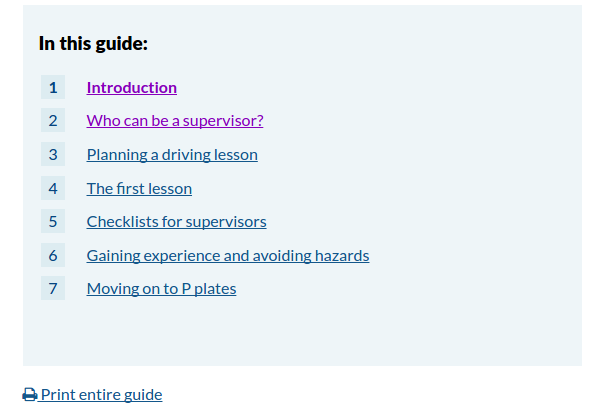

# Print remote pages
## Summary
With the help of this we can print the terms and conditions section pages content.

## Usage
Add **qg-print-guide** class to the toc. Please note that the script checks the combination of toc id and qg-print-guide class.

```
<div class="section qg-print-guide" id="toc">
    <div class="border">

    <h3>In this guide:</h3>

    <ol>

        <li><a href="/transport/licensing/getting/education/supervisor/"><span class="page-number">1</span><span class="link-text">Introduction</span></a></li>

        <li><a href="/transport/licensing/getting/education/supervisor/who/"><span class="page-number">2</span><span class="link-text">Who can be a supervisor?</span></a></li>

        <li><a href="/transport/licensing/getting/education/supervisor/planning/"><span class="page-number">3</span><span class="link-text">Planning a driving lesson</span></a></li>

        <li><a href="/transport/licensing/getting/education/supervisor/first-lesson/"><span class="page-number">4</span><span class="link-text">The first lesson</span></a></li>

        <li><a href="/transport/licensing/getting/education/supervisor/checklists/"><span class="page-number">5</span><span class="link-text">Checklists for supervisors</span></a></li>

        <li><a href="/transport/licensing/getting/education/supervisor/experience/"><span class="page-number">6</span><span class="link-text">Gaining experience and avoiding hazards</span></a></li>

        <li><a href="/transport/licensing/getting/education/supervisor/p-plates/"><span class="page-number">7</span><span class="link-text">Moving on to P plates</span></a></li>

    </ol>

</div></div><!-- end #toc, .border -->
```

## Screenshots
