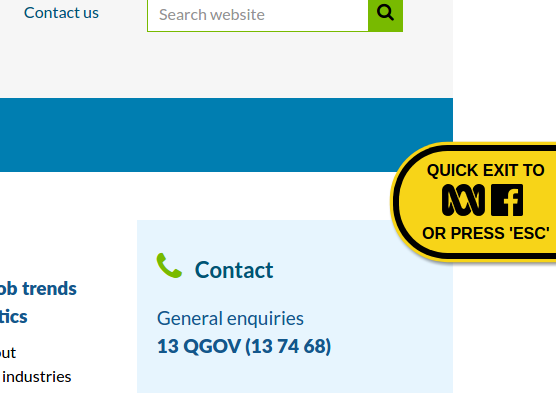

# Quick Exit
## Summary
Quick Exit from a page.

## Usage
### How to display Quick Exit on a page
Include following code in your HTML file.

```
<div id="quick-exit">
    <header><strong>Quick exit to</strong></header>
</div>
```

## Screenshots
