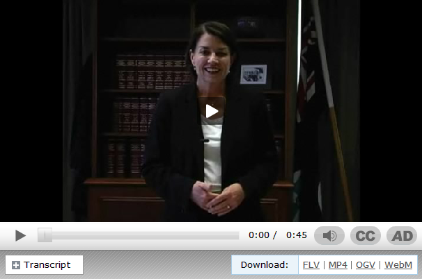

# Video pattern

Use this pattern to include a video within a content page.

## Technical requirements for publishing video
- Poster image. This image is shown until the user chooses to play the video. It should be the same width and height as the video, and provide a clue as to what the video is about.
- Video in FLV format. This video will be played in the flash player.
- Video in MP4 format. This video is intended for mobile devices.
- Video in WebM format. This video is intended for HTML5 capable browsers.
- Accessibility requirements:
	- Captions ([timed text markup language](http://www.w3.org/TR/ttaf1-dfxp/) format).
    - Audio Description track (MP3 audio)
    - Transcript of the video (HTML content within your page)

## Hosting video assets
- Video pages (HTML) should be hosted on www.qld.gov.au (this is the domain the flash player is licenced for).
- Poster images must be hosted on the same domain as the video page (html).
- Captions must be hosted on the same domain as the video page (html).
- Video files (FLV, MP4, WEBM, etc.) can be hosted on an external server (and **must not** be hosted on www.qld.gov.au)
- Audio files (MP3) can be hosted on an external server (and **must not** be hosted on www.qld.gov.au)

You can find useful information about the state of video support in browsers, and how to encode video in various formats, from http://diveintohtml5.info/video.html

### Example video pattern markup (XHTML)
```html
<div class="qg-ovt">
    
    <div class="qg-ovt-alternatives">
        <ul class="qg-ovt-options">
            <li class="download">Download:
                <ul>
                    <li><a type="video/flv" href="http://www.communities.qld.gov.au/resources/disability/franchise-media/news-events/circus-therapy/circus3.flv"><span class="title">Circus Therapy</span> <span class="meta">(31 seconds, FLV 7.5 MB)</span></a></li>
                </ul>
            </li>
            <li class="captions"><a href="video/captions.xml">Captions (Timed Text)</a></li>
            <li class="audio-description"><a href="http://www.communities.qld.gov.au/resources/disability/franchise-media/news-events/circus-therapy/audio-description.mp3">Audio description</a></li>
        </ul>
        <div class="qg-ovt-transcript">
            <h2>Video transcript</h2>
            <p>Trainers and occupational therapist aides, along with participants in the Unthink the Impossible circus program, hold up and wave a large colourful parachute that's pink, purple and yellow as part of a team-building and grounding exercise. Everyone then sits under the parachute. Archie, Kai and Max stand in the middle of the parachute as it is waved around again. Ella, a class helper, assists the occupational therapist aides and trainers with waving the parachute.</p>
        </div>
    </div>
</div>
```


The template (and associated scripts) will read the information from this markup pattern and create the video player.

Make sure you load your video pages from a webserver via HTTP/HTTPS when testing. The video template controls will not work if you are viewing local files, because the flash API does not communicate with the javascript (this is a flash security restriction enforced on local files).

## Video link format
This is an extension of the document link pattern which contains essential information about the video, including MIME type, duration and file size.
```html
<a type="MIME_TYPE" href="URL_OF_VIDEO">VIDEO_TITLE (VIDEO_DURATION, VIDEO_TYPE VIDEO_FILE_SIZE)</a>
```

Supported mime types: `video/flv` (flash video), `video/mp4` (MPEG4 video)

Duration can be approximate. Examples: '3 minutes', '27 seconds', '5 minutes 45 seconds'
