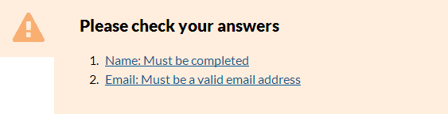
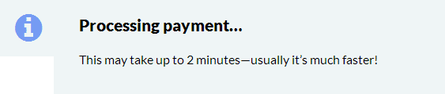
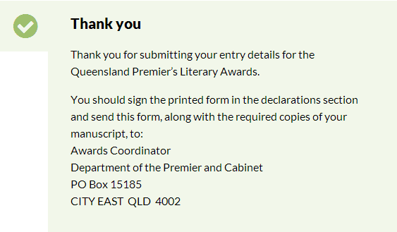
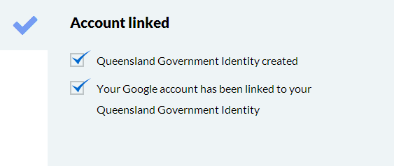

# Web applications

- [Status box](#status-box)
  - [Warnings](#warnings)
  - [Information](#information)
  - [Success](#success)
  - [Success (step)](#success-(step)) 

## Status box
### Warnings
### XHTML 1.0
```html
<div class="status warn">
<h2>Please check your answers</h2>
<ol>
    <li><a href="#QName">Name: Must be completed</a></li>
    <li><a href="#QEmail">Email: Must be a valid email address</a></li>
</ol>
</div>
```
### Screenshot


### Information
### XHTML 1.0
```html
<div class="status info">
<h2>Processing payment…</h2>
<p>This may take up to 2 minutes—usually it’s much faster!</p>
</div>
```
### Screenshot


### Success
Use for final state of a transaction. See 'Success step' below for alternative.
### XHTML 1.0
```html
<div class="status success">
<h2>Thank you</h2>
    <p>Thank you for submitting your entry details for the Queensland Premier’s Literary Awards.</p>
    <p>You should sign the printed form in the declarations section and send this form, along with the required copies of your manuscript, to:<br />
       Awards Coordinator<br />
       Department of the Premier and Cabinet<br />
       PO Box 15185 <br />
       CITY EAST&nbsp; QLD&nbsp; 4002<br />
    </p>
</div>
```
### Screenshot


### Success (step)
Use when displaying step for a sub-process within a larger transaction.
e.g. account created success message as part of a payment transaction.
### XHTML 1.0
```html
<div class="status success-step">
  <h2>Account linked</h2>
  <ul class="checklist">
    <li>Queensland Government Identity created</li>
    <li>Your Google account has been linked to your Queensland Government Identity</li>
  </ul>
</div>
```
### Screenshot

